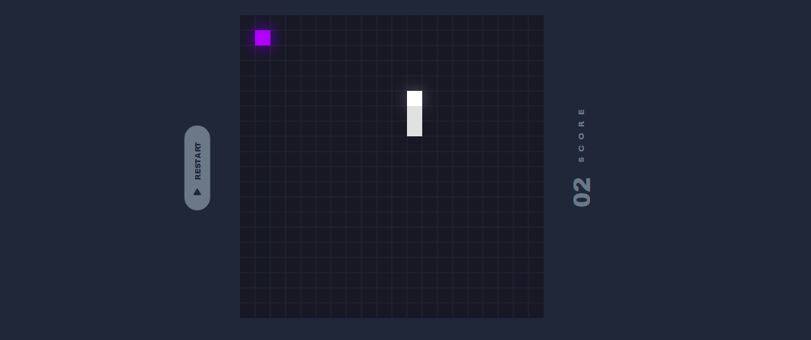

# Snake Game JavaScript

A classic Snake game implemented in JavaScript, HTML, and CSS. Control the snake, eat food, and try to achieve the highest score without hitting the walls or yourself. The project demonstrates clean code structure, responsive design, and smooth gameplay.

## Features

- Responsive and intuitive controls  
- Real-time score tracking  
- Simple and clean UI  
- Easily customizable

## Getting Started

1. Clone the repository.
2. Open `index.html` in your browser.
3. Enjoy the game!
